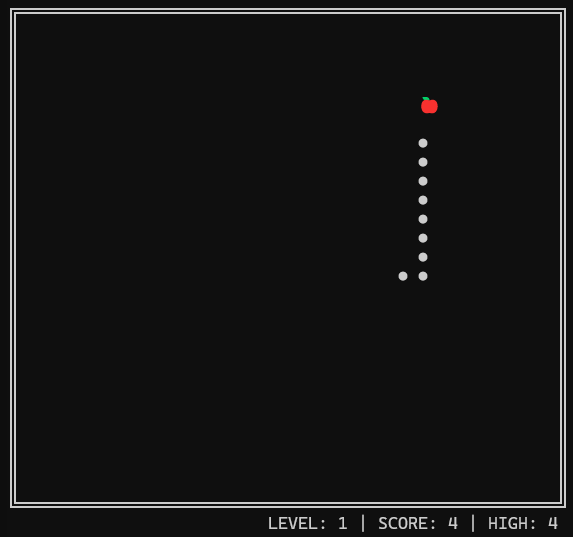
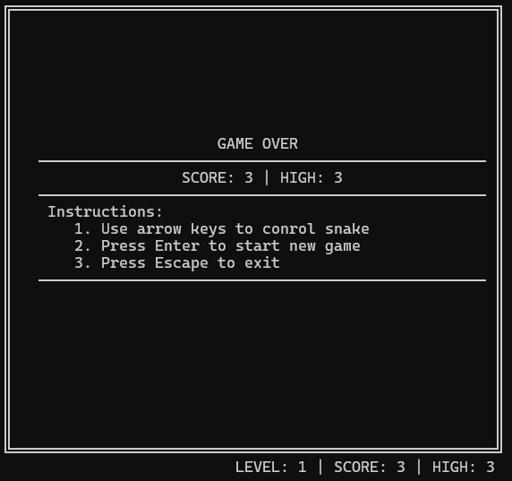

# Snake Game in C#

This is a classic Snake game implemented in C#. The game runs in the console and features a simple, interactive gameplay experience.

## Features

- Playable Snake game in the console
- Dynamic frame and snake movement
- Fruit spawning and score tracking
- Level progression and high score
- Game over and restart functionality

## How to Play

- Use the **arrow keys** to control the direction of the snake.
- Eat the fruit to grow longer and increase your score.
- Avoid running into the walls or your own tail.
- Press **Enter** to start or restart the game.
- Press **Esc** to exit.

## Screenshots

|        Start Screen         |            Gameplay            |            Game Over            |
| :-------------------------: | :----------------------------: | :-----------------------------: |
|  |  |  |

## Getting Started

### Prerequisites

- [.NET 9 SDK](https://dotnet.microsoft.com/download)

### Build and Run

1. Clone or download this repository.
2. Open a terminal in the project directory.
3. Build the project:
   ```sh
   dotnet build
   ```
4. Run the game:
   ```sh
   dotnet run
   ```

## Project Structure

- `Program.cs` - Entry point for the game
- `Game.cs` - Main game logic
- `Snake.cs` - Snake movement and state
- `Fruit.cs` - Fruit spawning and detection
- `Frame.cs` - Drawing the game frame
- `Message.cs` - Game messages and instructions

## License

This project is provided for educational purposes.
